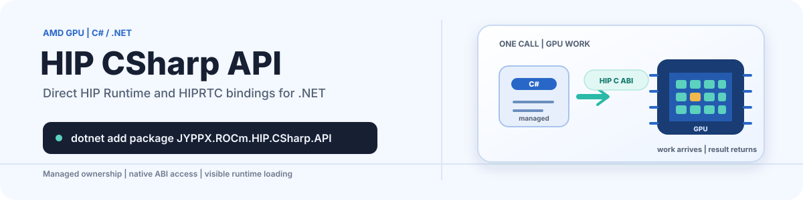

<picture>
  <source media="(prefers-color-scheme: dark)" srcset="docs/images/readme/hero-dark.svg">
  <source media="(prefers-color-scheme: light)" srcset="docs/images/readme/hero-light.svg">
  
</picture>

<p align="center">
  Direct AMD HIP Runtime and HIPRTC bindings for C# and .NET, with managed resource owners and a complete generated low-level C ABI.
</p>

<p align="center">
  <a href="https://github.com/guojin-yan/HIP-CSharp-API/actions/workflows/ci.yml"></a>
  <a href="LICENSE"></a>
  <a href="https://www.nuget.org/packages/JYPPX.ROCm.HIP.CSharp.API"></a>
  <a href="https://www.nuget.org/packages/JYPPX.ROCm.HIP.CSharp.API"></a>
  <a href="docs/compatibility/frameworks.md"></a>
  <a href="https://github.com/guojin-yan/HIP-CSharp-API/stargazers"></a>
</p>

<p align="center"><strong>English</strong> | <a href="README.zh-CN.md">简体中文</a></p>

# ⚡ HIP CSharp API

HIP CSharp API provides direct .NET bindings for the AMD HIP Runtime and HIPRTC C APIs. The single `JYPPX.ROCm.HIP.CSharp.API` assembly exposes the `JYPPX.ROCm.HipSharp` namespace, combining ergonomic managed owners for common GPU workflows with generated low-level entry points for applications that need the native ABI directly.

## 📖 Introduction

The project is designed around three boundaries:

- **Managed ownership:** device memory, pinned and managed memory, streams, events, modules, kernels, graphs, and HIPRTC programs use explicit `IDisposable` ownership.
- **Direct native access:** `HipRuntimeNativeApi` and `HipRtcNativeApi` expose the generated HIP C ABI without introducing a project-owned C++ bridge.
- **Explicit native runtime:** the managed package does not contain an AMD driver, ROCm installation, or native HIP libraries. Native loading and diagnostics remain visible to the caller.

The public API includes bilingual Chinese/English XML documentation and is kept identical across all declared target frameworks.

## ✨ Key Features

- Managed APIs for device discovery, allocation, copies, synchronization, streams, events, modules, kernels, and HIPRTC compilation.
- Advanced owners for stream-ordered allocation, managed-memory advice and prefetch, peer access, and HIP graph capture/replay.
- A complete generated low-level surface based on pinned HIP 7.2.1 headers: 459 HIP Runtime declarations and 18 HIPRTC declarations.
- Source-generated `LibraryImport` on .NET 7 and later, with `DllImport` compatibility on older targets.
- Deterministic interop generation, a frozen public API snapshot, package audits, and managed tests that do not require a GPU.
- A friend-only atomic stream enqueue/pending-callback boundary for the separately packaged MIGraphX adapter, without adding a public raw-handle API or a core dependency on MIGraphXSharp.
- Runnable correctness samples for memory copies, HIPRTC VectorAdd, stream/event ordering, graphs, managed memory, and P2P copy-or-skip behavior.

## 📢 Current Status: Published Preview / 0.x Validation

Core `0.10.0` is published on nuget.org. The optional Linux Runtime is now identified as `JYPPX.ROCm.HIP.CSharp.API.Runtime.ubuntu.24.04-x64`; it is intentionally blocked from publication until a fresh exact-package audit and GPU validation pass. The exact Core package passed the official-host and isolated package-only Linux GPU/ABI gates on Ubuntu 24.04.4 / ROCm 7.2.1 / `gfx1100`.

Core `0.10.0` includes the HIPRTC Program/Linker managed expansion and the updated runnable tutorial and showcase set. The pinned ROCm 7.2.1 runtime retains a documented upstream `hipMemRetainAllocationHandle` reference-counting defect; see the [0.10.0 release notes](docs/releases/0.10.0.md). Windows AMD GPU validation remains mandatory before any future `1.0.0` release; this `0.10.0` work does not satisfy or bypass that condition.

## 🚀 Get Started In 30 Seconds

Install the published managed Core and use a compatible system ROCm installation while the distribution-specific Runtime replacement is revalidated:

```powershell
dotnet add package JYPPX.ROCm.HIP.CSharp.API --version 0.10.0
```

To run from source, use the .NET 10 SDK selected by `global.json` and a machine with a working AMD driver plus compatible HIP/ROCm user-mode runtime:

```powershell
git clone https://github.com/guojin-yan/HIP-CSharp-API.git
cd HIP-CSharp-API
dotnet run --project .\samples\tutorials\01-RuntimeDevice\EnvironmentAndDevice\EnvironmentAndDevice.csproj -c Release
```

The essential managed API is intentionally small:

```csharp
using System;
using JYPPX.ROCm.HipSharp;
using JYPPX.ROCm.HipSharp.Types;

var runtime = new HipRuntime();
runtime.Initialize();

HipRuntimeVersionInfo versions = runtime.GetVersionInfo();
Console.WriteLine($"HIP Runtime: {versions.RuntimeVersion}");
Console.WriteLine($"HIP Driver:  {versions.DriverVersion}");

foreach (HipDevice device in runtime.GetDevices())
{
    Console.WriteLine(device);
}
```

Applications using the managed package must still provide compatible native `amdhip64` and, when using runtime compilation, `hiprtc` libraries. See [platform compatibility](docs/compatibility/platforms.md) before choosing a deployment configuration.

## 📦 Package Layout

| Package | Contents |
| --- | --- |
| <code>JYPPX.ROCm.HIP.CSharp.API</code> | Managed HIP Runtime and HIPRTC C# API across the declared .NET target frameworks |
| <code>JYPPX.ROCm.HIP.CSharp.API.Runtime.ubuntu.24.04-x64</code> | Ubuntu 24.04 x64 ROCm 7.2.1 user-mode runtime candidate; publication blocked pending fresh validation |
| <code>JYPPX.ROCm.HIP.CSharp.API.Runtime.win-x64</code> | Disabled Windows runtime skeleton with no native inventory; not a usable runtime package |

The Core package is dependency-free and never installs a GPU driver. Runtime packages are optional deployment artifacts with independent versioning and stricter publication gates. Read the [Linux runtime package guide](docs/guides/linux-runtime-package.md) for the exact native boundary.

## 🌐 Public Packages And Release Assets

The Core package is available on NuGet.org. The Ubuntu 24.04 Runtime package is not yet published. The repository has an annotated `v0.10.0` Git tag; release assets are not uploaded.

Future stable Core package releases are published by the tag-triggered [NuGet release workflow](.github/workflows/nuget-release.yml), which reads the `NUGET_API_KEY` Actions secret only at publish time.
After exact-package promotion, the Ubuntu 24.04 Runtime is published to NuGet.org and attached with its SHA-256 to GitHub Releases by the dedicated [Runtime release workflow](.github/workflows/runtime-ubuntu-24.04-release.yml).

| Package | Version | NuGet.org | Purpose |
| --- | --- | --- | --- |
| <code>JYPPX.ROCm.HIP.CSharp.API</code> | [](https://www.nuget.org/packages/JYPPX.ROCm.HIP.CSharp.API/) | [Gallery](https://www.nuget.org/packages/JYPPX.ROCm.HIP.CSharp.API/) | Core managed HIP Runtime and HIPRTC API |

| Release channel | Link | Assets |
| --- | --- | --- |
| Git tag | [v0.10.0](https://github.com/guojin-yan/HIP-CSharp-API/tree/v0.10.0) | No uploaded release assets |
| NuGet.org | [Package search](https://www.nuget.org/packages?q=JYPPX.ROCm.HIP.CSharp.API) | Published Core package |

### 🧩 Runtime package matrix

Every current Runtime package project is listed below. The Windows package remains an inventory-empty, disabled static-audit skeleton and has no NuGet.org package.

| Package ID | Version | RID | Native baseline | Publication state |
| --- | --- | --- | --- | --- |
| <code>JYPPX.ROCm.HIP.CSharp.API.Runtime.ubuntu.24.04-x64</code> | `7.2.1` | Package identity: <code>ubuntu.24.04-x64</code>; native asset RID: <code>linux-x64</code> | ROCm 7.2.1 user-mode closure | Not published; exact-package audit/GPU validation required |
| <code>JYPPX.ROCm.HIP.CSharp.API.Runtime.win-x64</code> | Not published | <code>win-x64</code> | HIP SDK 7.2.0 skeleton | Disabled; no native inventory |

## 🧩 API Surface

| Area | Main managed types |
| --- | --- |
| Runtime and devices | `HipRuntime`, `HipDevice`, `HipRuntimeVersionInfo` |
| Memory | `HipDeviceMemory`, `HipTypedMemory<T>`, `HipPinnedMemory`, `HipManagedMemory`, `HipAsyncDeviceMemory` |
| Streams and events | `HipStream`, `HipEvent`, `HipAsyncLease` |
| Runtime compilation | `HipRtc`, `HipRtcProgram`, `HipRtcCompilation`, `HipRtcException` |
| Modules and kernels | `HipModule`, `HipKernel`, `HipLaunchDimensions`, `HipKernelArgument` |
| Graphs and peer access | `HipGraph`, `HipGraphExec`, `HipPeerAccess` |
| Loading and diagnostics | `HipLibraryLocator`, `HipNativeLibraryLoader`, `HipLibraryLoadDiagnostics` |
| Complete native ABI | `HipRuntimeNativeApi`, `HipRtcNativeApi` |

Use managed owners for normal application code. Use the low-level API when exact native signatures and native ownership semantics are required.

## 🖥️ Platforms And Frameworks

The Core project directly targets 15 frameworks:

`net46`, `net461`, `net462`, `net47`, `net471`, `net472`, `net48`, `net481`, `netcoreapp3.1`, `net5.0`, `net6.0`, `net7.0`, `net8.0`, `net9.0`, and `net10.0`.

| Platform | Core build/package | GPU validation | Runtime package |
| --- | --- | --- | --- |
| Ubuntu 24.04 x64 | Yes | Historical generic-ID Runtime `7.2.1` passed exact-package gates; the renamed package requires fresh validation | Use system ROCm; distribution-specific Runtime candidate is not published |
| Windows x64 | Yes; loader and PE paths are statically audited | Not yet validated on an AMD GPU | Disabled 7.2.0 skeleton |

Several older .NET targets are end-of-support upstream and exist only for package compatibility. The full distinctions between build compatibility, historical validation, and supported deployment are documented in [framework compatibility](docs/compatibility/frameworks.md) and [platform compatibility](docs/compatibility/platforms.md).

## 🧪 Examples

The [sample learning path](samples/README.md) is organized by HIP capability instead of individual API calls.
For the complete cloud-reproducible matrix, including retained logs and Windows reproduction notes, see
the [tutorial verification guide](samples/tutorials/README.md).

| Module | Entry sample | What it demonstrates |
| --- | --- | --- |
| Runtime/Device | [`EnvironmentAndDevice`](samples/tutorials/01-RuntimeDevice/EnvironmentAndDevice) | Runtime/driver versions and device enumeration |
| Memory | [`LinearMemoryCopy`](samples/tutorials/02-Memory/LinearMemoryCopy) | H2D, D2D, and D2H memory round trip |
| Execution | [`StreamAndEvent`](samples/tutorials/03-Execution/StreamAndEvent) | Non-blocking streams, events, and asynchronous ordering |
| Kernel | [`HipRtcVectorAdd`](samples/tutorials/04-Kernel/HipRtcVectorAdd) | HIPRTC compilation, module loading, kernel launch, and CPU verification |
| Graph | [`GraphCaptureReplay`](samples/tutorials/05-Graph/GraphCaptureReplay) | Stream capture, graph instantiation, and replay |
| Multi-device | [`PeerToPeerCopy`](samples/tutorials/06-MultiDevice/PeerToPeerCopy) | Capability-gated peer access and P2P copy |
| Data objects | [`ArrayTextureSurface`](samples/tutorials/07-DataObjects/ArrayTextureSurface) | Array, texture, and surface ownership |
| Low-level | [`NativeAbiInterop`](samples/tutorials/90-LowLevel/NativeAbiInterop) | Direct generated C ABI access for experts |
| Integrated showcase | [`HeatDiffusion`](samples/showcases/HeatDiffusion) | CPU/GPU heat simulation using HIPRTC, streams, events, graph replay, validation, and a BMP heatmap |
| Integrated showcase | [`VisualInspection`](samples/showcases/VisualInspection) | OpenCV CPU image pipeline paired with an AMD GPU HIPRTC defect-mask kernel, PNG masks, and JSON/CSV evidence |

GPU samples require the actual target architecture. For example:

```powershell
dotnet run --project .\samples\tutorials\04-Kernel\HipRtcVectorAdd\HipRtcVectorAdd.csproj -c Release -- --arch gfx1100 --length 1000 --repeat 20
```

Tutorial samples validate correctness and ownership behavior; they are not benchmarks and make no performance claim. The separate `HeatDiffusion` and `VisualInspection` showcases report CPU/GPU measurements scoped to the current process run and include dedicated [HeatDiffusion Radeon Cloud](samples/showcases/HeatDiffusion/README.md) and [VisualInspection Radeon Cloud](samples/showcases/VisualInspection/README.md) walkthroughs.

## 📚 Documentation

| Resource | Description |
| --- | --- |
| [Documentation index](docs/index.md) | DocFX entry point and bilingual guide index |
| [Complete native API](docs/guides/complete-native-api.md) | Generated low-level Runtime and HIPRTC surface |
| [HIPRTC VectorAdd](docs/guides/hiprtc-vectoradd.md) | Compile, load, launch, and verify a kernel |
| [Streams and events](docs/guides/hip-stream-event-vectoradd.md) | Asynchronous ordering and lifecycle guide |
| [Advanced APIs](docs/guides/advanced-apis.md) | Graphs, managed memory, stream-ordered allocation, and P2P |
| [Arrays, textures, and surfaces](docs/guides/array-texture-surface.md) | Owned arrays, mipmaps, texture/surface objects, and legacy borrowed references |
| [Linux runtime package](docs/guides/linux-runtime-package.md) | Provenance, dependency closure, and packaging boundary |
| [Windows runtime audit](docs/guides/windows-runtime-static-audit.md) | Current static-only Windows state |
| [API reference](docs/api/toc.yml) | Generated public API reference |
| [MIGraphX adapter lease design](docs/design/migraphx-adapter-pending-lease.md) | Internal stream callback boundary; no public HipSharp API addition |

Run `./eng/docs.ps1` to build the DocFX site under `_site`.

## 🔨 Build From Source

The repository pins the .NET `10.0.300` SDK through `global.json`.

```powershell
git clone https://github.com/guojin-yan/HIP-CSharp-API.git
cd HIP-CSharp-API
dotnet restore .\HipSharp.sln --locked-mode
.\eng\build.ps1 -Configuration Release -NoRestore
.\eng\test.ps1 -Configuration Release -NoBuild
.\eng\verify-public-api.ps1 -Configuration Release
```

On Linux, the equivalent Core gate is:

```bash
bash ./eng/build.sh Release
```

The build verifies deterministic interop output, all 15 target frameworks, tests, package contents, and public API consistency. Managed-only tests do not require an AMD GPU.

## 🗂️ Project Structure

```text
HIP-CSharp-API/
|-- src/JYPPX.ROCm.HipSharp/                 Managed owners and generated native APIs
|-- samples/                            Runnable device, memory, HIPRTC, and advanced samples
|-- tests/                              Unit, package, API-baseline, and repository-quality tests
|-- docs/                               DocFX reference, compatibility notes, guides, and releases
|-- eng/                                Build, generation, audit, packaging, and release gates
|-- nuget/                              Core/runtime package content and runtime manifests
|-- pack/                               Optional runtime package projects
|-- native/abi-probe/                   Native ABI verification probe
`-- .github/workflows/                  Continuous integration
```

## 🤝 Contributing

Issues and pull requests are welcome. Before changing the public API, native declarations, ownership behavior, package identity, or runtime payload, read [CONTRIBUTING.md](CONTRIBUTING.md) and the [API-freeze guide](docs/guides/api-freeze.md). Security reports should follow [SECURITY.md](SECURITY.md) rather than a public issue. Chinese readers can use the [中文贡献指南](CONTRIBUTING.zh-CN.md).

## 🙏 Acknowledgments

This project builds on [AMD HIP](https://github.com/ROCm/HIP) and the wider ROCm ecosystem. AMD remains the authoritative source for HIP behavior, platform requirements, and third-party runtime licensing.

## 📄 License

The project source is licensed under the [Apache License 2.0](LICENSE). Any packaged ROCm components retain their own licenses and notices; the project license does not replace those terms.

## 📮 Contact, Community And Sponsorship

- [GitHub Issues](https://github.com/guojin-yan/HIP-CSharp-API/issues) for bugs and feature requests.
- [GitHub Discussions](https://github.com/guojin-yan/HIP-CSharp-API/discussions) for usage questions.
- QQ group `945057948` for community discussion.

<p align="center">
  
</p>

---

## ⚠️ Software Notice And Disclaimer

### 📜 1. Open-source License Notice

All code in the author's open-source projects is licensed under the **Apache License 2.0**.

*Special note: this project integrates several third-party libraries. If any third-party library license conflicts with or differs from Apache 2.0, that third party's original license prevails. This project neither includes nor represents the license notices for those third-party libraries; read and comply with their applicable licenses before use.*

### 🤖 2. Code Development And Quality Notice

- **AI-assisted development:** Artificial intelligence (AI) was used to help generate and optimize this code during development; it was not written entirely by hand, line by line.
- **Security commitment:** **The author solemnly states that this code contains no intentionally installed backdoors, viruses, trojans, or malicious code intended to damage user devices or steal data.**
- **Technical limitations:** Given the author's individual technical experience and capabilities, the code may contain basic issues caused by imprecise logic, insufficient optimization, or limited experience, including but not limited to memory leaks, intermittent crashes, or unreleased resources. Such issues are unintentional and stem from those limitations.
- **Testing scope:** Because the author's time is limited, this software has not undergone complete testing across every edge case.

### 🚨 3. Disclaimer (Important)

**Before applying this code to any real project, especially a commercial, industrial, or mission-critical environment, perform thorough and rigorous independent testing and validation.** In view of the possible code defects and incomplete testing described above, **the author accepts no responsibility for any direct or indirect loss caused by using this code, including but not limited to device failure, data loss, system outage, or lost profits.** By using this code, you acknowledge these risks and agree to bear all resulting consequences yourself; related matters are not the author's responsibility.

### 🔓 4. Scope Of Open Source

This project makes its core logic fully open source. The binary files, source code, and related resources of the third-party libraries mentioned above are outside this project's open-source obligations; obtain them according to their respective instructions.

### 🤝 5. Community And Feedback

Despite these limitations, downloads, Issues, and testing contributions are welcome to help improve the project. If you encounter a bug, out-of-memory condition, or have an improvement suggestion, contact the author through the project homepage. Assistance will be provided to the best of the author's ability and available time.

Copyright (c) 2026 Guojin Yan.
