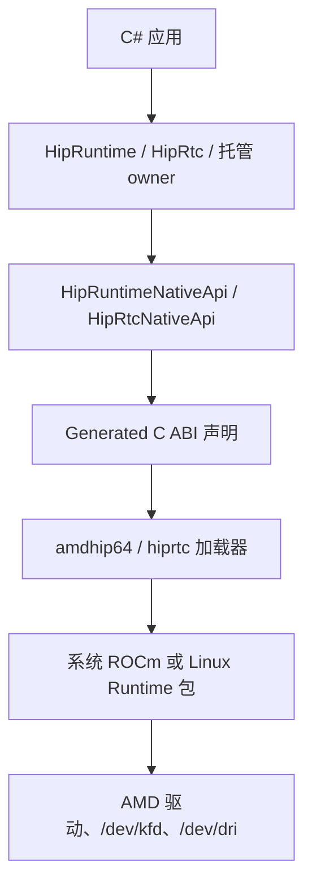

# 为什么采用 Direct C ABI，而不是全量 C++ Bridge

## 前言

**HIP CSharp API** `0.10.0` 预览版的核心选择，是直接站在 AMD HIP 已经提供的 C ABI 上，为 C#/.NET 提供托管 API。本文解释这个选择的原因、调用链路和边界。

本文对应仓库 `v0.10.0`，源码仓库为 <https://github.com/guojin-yan/HIP-CSharp-API>，核心包为 `JYPPX.ROCm.HIP.CSharp.API`。这里讨论的是 Runtime 和 HIPRTC 的互操作设计，不展开显存、Stream 或 HIPRTC Linker 的具体生命周期。

## 一、先把问题说清楚

C# 调用 GPU，通常有三条路：

| 路径 | 需要维护的东西 | 常见问题 |
| --- | --- | --- |
| P/Invoke 到 C ABI | 函数签名、结构体、指针和加载器 | 绑定容易分散，错误信息和资源释放不统一 |
| 自己写 C++ Bridge | C++ 导出层、ABI、额外构建系统和 C# 声明 | 每个新能力都要同时改三层，调试边界更长 |
| 直接使用现成托管库 | 由库决定覆盖面和资源模型 | HIP 新接口、诊断信息和底层扩展不一定能及时暴露 |

HIP Runtime 和 HIPRTC 本身已经提供稳定的 C 入口。再增加一个覆盖全部接口的 C++ Bridge，并不会让 HIP 的执行规则变得更简单，反而会多出一套需要同步维护的接口。

所以项目把工作拆成两件事：先准确绑定 AMD 的 C ABI，再在 C# 层补上资源所有权、异常和诊断。这样既不隐藏 HIP 的真实语义，也不让普通 .NET 项目从 `IntPtr` 开始写起。

## 二、调用链路

从应用代码到 GPU，实际经过下面几层：



普通应用只需要托管层：

```csharp
using var runtime = new HipRuntime();
runtime.Initialize();

HipRuntimeVersionInfo versions = runtime.GetVersionInfo();
IReadOnlyList<HipDevice> devices = runtime.GetDevices();
```

需要检查原始返回值或扩展接口时，再进入 `JYPPX.ROCm.HipSharp.Interop` 中的低层类型。低层绑定保留原生指针和错误码的规则，不替调用方接管原生资源。

## 三、为什么不增加全量 C++ Bridge

### 3.1 HIP 的 C ABI 已经是自然边界

HIP Runtime 的入口例如 `hipInit`、`hipGetDeviceCount`、`hipMalloc` 和 `hipMemcpyAsync`，以及 HIPRTC 的 `hiprtcCreateProgram`、`hiprtcCompileProgram` 和 `hiprtcLinkComplete`，本来就是 C ABI。C# 需要解决的是调用约定、字符串、指针、数组和返回值封送，而不是重新设计一层 C++ 对象模型。

### 3.2 Bridge 会扩大维护面

如果加入一个全量 C++ Bridge，每个函数至少要维护：HIP 头文件、C++ 导出函数、Bridge 的错误转换、C# 声明和托管包装。HIP 增加一个入口时，几层代码必须同时更新；其中任意一层落后，运行时才会暴露问题。

Direct C ABI 让 native 边界保持短而明确。托管层只为实际需要的对象补充 owner 和使用约束，低层接口仍然可以访问完整的生成式声明。

### 3.3 绑定和托管 API 可以分开审核

当前固定 ROCm/HIP `7.2.1` 头文件生成了：

| 层级 | 当前规模或职责 |
| --- | --- |
| HIP Runtime 低层声明 | 459 个公开 C 函数模型 |
| HIPRTC 低层声明 | 18 个公开 C 函数模型 |
| 托管 owner | 设备、内存、Stream/Event、Module/Kernel 和 HIPRTC 常用路径 |
| 未提升接口 | 保留在低层，等待单独的能力和生命周期验证 |

这些数字表示声明和审核规模，不代表所有函数已经在所有 GPU 和平台完成实机验证。

## 四、生成式声明如何跨越 .NET 版本

项目对现代和旧目标框架采用不同的互操作声明方式：

| 目标框架 | 声明方式 | 原因 |
| --- | --- | --- |
| .NET 7 及以上 | `LibraryImport` | 使用源生成器和显式调用约定 |
| 更早的目标框架 | `DllImport` | 保持旧 .NET Framework 的可用性 |

这不是两个 API 面。两种声明都指向同一组 HIP C ABI EntryPoint，例如 Linux 上的 `libamdhip64.so`、`libhiprtc.so`，Windows 上的 `amdhip64_7.dll`、`hiprtc0702.dll`。

生成文件之外，项目还会检查头文件版本、EntryPoint、参数方向、枚举值和平台资产。生成器解决重复劳动，审核规则负责避免“能编译但 ABI 不对”。

## 五、加载器为什么属于 ABI 设计的一部分

绑定正确并不等于库能加载。加载器需要回答三个问题：

1. 应该从哪里找 `amdhip64` 和 `hiprtc`？
2. 找到的文件是否真的导出了 `hipInit` 或 `hiprtcVersion`？
3. Runtime 和 HIPRTC 是否来自同一个用户态闭包？

候选路径按稳定顺序检查：应用目录、应用目录下的 RID Runtime 资产、`ROCM_PATH`、`HIP_PATH`、标准 ROCm 路径和操作系统搜索路径。失败时保留候选来源、目标框架和运行时标识，并对本地绝对路径做脱敏。

加载 Runtime 和 HIPRTC 后，项目会记录用户态闭包身份，拒绝把一套系统 ROCm 和另一套 Runtime 包混在同一个进程中。这样做不是为了限制部署方式，而是为了避免 `amdhip64`、`hiprtc`、COMGR 和 builtins 跨版本组合后出现难以解释的错误。

## 六、什么时候应该使用哪一层

- 普通应用：从 `HipRuntime`、`HipDeviceMemory`、`HipStream`、`HipEvent`、`HipModule`、`HipKernel` 和 `HipRtc` 开始。
- 排查加载：读取托管异常中的候选路径、Runtime 来源和错误上下文。
- 扩展尚未提升的 HIP 接口：使用 `HipRuntimeNativeApi` 或 `HipRtcNativeApi`，同时自己承担原生所有权规则。
- 研究 ABI：查看 `Generated` 声明、固定头文件和绑定审核结果，不要把生成文件当成托管 API 契约。

低层 API 的存在不是要求每个使用者都写指针代码，而是给需要验证和扩展的人留一条可审计的路径。

## 七、最小验证

从仓库根目录运行设备案例：

```bash
dotnet run --project samples/tutorials/01-RuntimeDevice/EnvironmentAndDevice/EnvironmentAndDevice.csproj -c Release
```

本文验证环境中的关键输出为：

```text
HIP Runtime: 7.2.53211
HIP Driver:  7.2.53211
0: AMD Radeon Graphics
```

这只能说明原生库加载、HIP 初始化和设备枚举成功。它不能单独证明 Kernel、HIPRTC 或跨平台兼容性已经完成验证。

## 八、限制与结论

Direct C ABI 减少了 Bridge 层，但没有消除 ABI 的复杂性。调用方仍然需要使用匹配的 HIP/ROCm 用户态库、驱动和设备节点；指针、异步操作和原生对象的生命周期也不能靠 P/Invoke 自动解决。

这个选择的实际价值，是把需要维护的边界缩短：HIP 规则继续由 HIP 定义，生成式绑定负责准确调用，托管层负责 .NET 开发者真正需要的 owner、异常和诊断。

## 九、文章声明

- **开源协议：** 项目源码采用 Apache License 2.0；ROCm 组件保留各自许可证和通知。
- **AI 辅助开发：** 项目开发、测试和文档编写过程中使用了人工智能辅助，最终内容由维护者复核。
- **测试范围：** 本文命令和输出来自 Ubuntu 24.04、ROCm 7.2.1、`gfx1100` 验证环境；绑定规模来自固定 HIP 7.2.1 头文件的静态审核。
- **平台限制：** Windows AMD GPU 实机验证尚未完成，其他 GPU、发行版和 Runtime 组合需要重新验证。
- **供应商依赖：** AMD HIP/ROCm、驱动和 NuGet.org 受其自身版本、许可证和服务条款约束。
- **免责声明：** 商业或关键任务环境使用前，请自行完成完整测试和供应链审计。
- **社区反馈：** 欢迎通过 <https://github.com/guojin-yan/HIP-CSharp-API/issues> 提交可公开的最小复现和环境信息。

Copyright (c) 2026 Guojin Yan.
