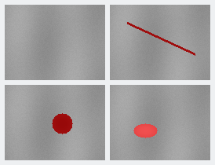

# 综合案例

<p align="center">
  <a href="README.md">English</a> | <strong>简体中文</strong>
</p>

<p align="center">
  
  
</p>

综合案例是了解 HIP CSharp API 最快的入口。每个案例都把 HIPRTC、托管资源所有权、GPU 执行、
CPU/GPU 正确性校验和结构化产物组合成一个可以复现的应用级工作负载。

> 不想只看源码，想直接运行 Demo？
> 打开 [AMD Radeon Cloud](https://developer.amd.com.cn/login?source=J2RtJQRgM)，启动
> Ubuntu/ROCm GPU 实例，克隆本仓库，然后按下面的命令运行。两个案例都提供了面向该环境的运行脚本。

## 选择一个案例

<table>
<thead>
<tr>
<th>案例</th>
<th>你会看到什么</th>
<th>适合从哪里开始</th>
</tr>
</thead>
<tbody>
<tr>
<td><a href="HeatDiffusion/README.zh-CN.md"><strong>HeatDiffusion</strong></a></td>
<td>CPU 参考实现和 HIPRTC 五点差分实现计算同一个二维热场，同时展示 Stream、Event、Graph 重放和热力图生成。</td>
<td>第一次运行 GPU Demo，学习 HIP 基础</td>
</tr>
<tr>
<td><a href="VisualInspection/README.zh-CN.md"><strong>VisualInspection</strong></a></td>
<td>OpenCV 生成 CPU 缺陷掩码，HIPRTC Kernel 生成 GPU 掩码；四组测试图逐字节校验，并输出 JSON、CSV 和 PNG 证据。</td>
<td>应用流水线和计算机视觉</td>
</tr>
</tbody>
</table>

## Radeon Cloud：五分钟完成体验

Radeon Cloud 是首次运行的推荐环境，因为它提供这些案例所需的 AMD GPU、HIP Runtime 和 ROCm
用户态库。

1. 在 [developer.amd.com.cn](https://developer.amd.com.cn/login?source=J2RtJQRgM) 登录。
2. 启动 Ubuntu/ROCm GPU 实例，并在实例工作区打开终端。
3. 克隆仓库并进入项目根目录：

   ```bash
   git clone https://github.com/guojin-yan/HIP-CSharp-API.git
   cd HIP-CSharp-API
   ```

4. 运行任意一个案例。案例旁的脚本会检查 GPU、选择兼容的 .NET SDK、使用 locked mode 还原、
   构建 Release、检测 gfxNNNN 架构，并将产物写入 artifacts/：

   ```bash
   bash ./samples/showcases/HeatDiffusion/run-heat-diffusion.sh
   bash ./samples/showcases/VisualInspection/run-visual-inspection.sh
   ```

第一次体验建议先运行 HeatDiffusion 的 tiny 配置，或直接运行 VisualInspection 的内置四组
测试图。首次成功后，再阅读完整教程：

- [HeatDiffusion：在 Radeon Cloud 中运行](HeatDiffusion/README.zh-CN.md#在-radeon-cloud-运行)
- [VisualInspection：在 Radeon Cloud 中运行](VisualInspection/README.zh-CN.md#在-radeon-cloud-中五分钟完成运行)

这些脚本用于帮助复现，不等同于项目 Owner 授权的正式验证会话。个人 Cloud 运行适合学习和
分享结果，不应写成项目发布门禁，也不应作为跨设备性能基准。

## 每个案例会产生什么

| 案例 | 正确性契约 | 产物 |
| --- | --- | --- |
| HeatDiffusion | GPU 每个网格值都必须在文档规定的 CPU 参考容差内。 | summary.json，可选 heatmap.bmp |
| VisualInspection | 每张 GPU 掩码都必须同时匹配 OpenCV 参考掩码和期望掩码。 | inspection-summary.json、inspection-results.csv、masks/*.png |

输出耗时只描述当前进程、设备、驱动、工作负载和运行次数。请把它们视为演示数据，而不是
普遍性能承诺。

## 它们在项目中的位置

综合案例属于应用级示例，和编号教程、发布验证门禁分开维护，但使用的正是实际消费者会调用的
公开托管 API。

| CasePlan 优先级 | 案例 | 状态 |
| --- | --- | --- |
| P0 热场 | 热扩散 / 热异常监测 | 已实现，并完成 Radeon Cloud 验证 |
| P1 视觉 | 工业缺陷分割 | 已结合 OpenCV-CSharp-API 实现，并完成 Radeon Cloud 验证 |
| P2 振动 | 时域/频域健康分析 | 等待 rocFFT 绑定后实现 |
| P3 推理 | 模型推理流水线 | 等待 MIGraphX 或 ONNX Runtime 集成后实现 |

## 继续阅读

- 想最快从 C# 运行 HIPRTC Kernel，请从 [HeatDiffusion](HeatDiffusion/README.zh-CN.md) 开始。
- 想了解 GPU Kernel 如何嵌入 CPU/OpenCV 应用流水线，请继续阅读 [VisualInspection](VisualInspection/README.zh-CN.md)。
- 想按模块学习 HIP API，请返回[案例索引](../README.zh-CN.md)。
